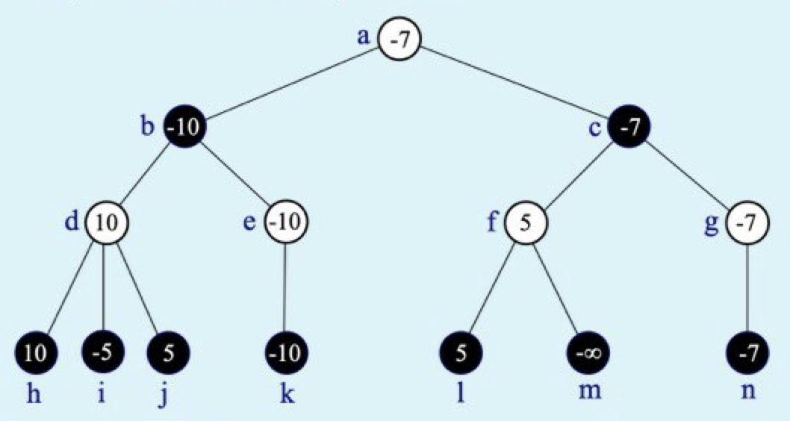

## úloha 1

Na vstupu je posloupnost *n* přirozených čísel a přirozené číslo *k*. Určete nejmenší přirozené číslo, které se
ve vstupní posloupnosti nevyskystuje a současně je >= *k*.

Navrhněte postup, jak správně vyřešit úlohu s co nejlepší časovou a prostorovou složitostí vzhledem k délce vstupní posloupnosti. PLný počet bodů
bude udělen je nza řešení s časovou i prostorovou složitostí O(*n*).

(a) Popište algoritmus: programový kód v Pathonu je vítán, ale není povinný, slovní vysvětlení zvoleného postupu řešení naopak povinné
je. Nepoužívejte žádné netriviální datové struktury (typu zásobník fronta, halda, slovník), jejichž algoritmus sami nepopíšete a neodvodíte jeho časovou složitost.

(b) Zdůvodněte správnost algoritmu.

(c) Odvoďte časovou a prostorovou složitost (v nejhorším případě).

Příklad:

Vstup: 22 8 5 2000 6 5 2 100000 7 10 2 6 1

5

Výstup: 9

## úloha 2

Je zadán binární strom. Navrhněte efektivní algoritmus, který zjistí, zda je zadaný strom dokonale vyvážený, tj. zda pro každý vrchol stromu
platí, že počty vrcholů v jeho levém a pravém podstromu se liší nejvíce o 1.

(a) Svoje řešení zapište jako funkci v Pythonu, využijte definici třídy pro vrchol binárního stromu níže,

(b) zdůvodněte psrávnost,

(c) odvoďte časovou složitost.

```python
class VrcholBinStromu:
    """třída pro reprezentaci vrcholu binárního stromu""" 
    def __init__(self, x = None, levy = None, pravy = None)
        self.info = x # data 
        self.levy = levy # levé dítě 
        self.pravy = pravy # pravé dítě
```
Poznámka: Zajímá nás pouze tvar stromu, tzn. uspořádání jeho vrcholů. Vůe´bec nehledíme na hodnoty uložené ve vrcholech stromu (atribut info).

## úloha 3

(a) Dokažte, nebo vyvraťte každé z následujících tvrzení:
- existuje funkce f: N -> R+ taková, že f = O(f^2)
- existuje funkce f: N -> R+ taková, že f = Omega(f^2)
- existuje funkce f: N -> R+ taková, že f = Theta(f^2)

(b) Vstup: pole a obsahující n čísel (která se mohou opakovat) setříděných vzestupně, číslo x

Výstup: indexy i,j takové, že a[i,..,j] obsahuje všechny výskyty čísla x

Dokažte, nebo vyvraťte problém lze vyřešit - v nejhorším příadě - v čase O(log n) a pracovní pamětí O(1).

Poznámka: Do pracovní paměti nezahrnujeme pole a, pokud z něj pouze čteme.

(c) Strom hry dvou hráčů byl vygenerován do hloubky 3, všechny vrcholy v této hloubce byly ohodnoceny
statickou ohodnocovací funkcí a hodnoty zbývajících vrcholů byly spočítány minimaxovým algoritmem.
V bílých vrcholech je na tahu hráč maximum, v černých minimum.
Výpočet bychom rádi zrychlili metodou alfa-beta prořezávání.



(c1) V jakém pořadí je třeba procházet strom, abychom se alfa-beta prořezáváním vyhnuli vyhodnocení co nejvíce vrcholů?
Kolik vrcholů v takovém případě nemuséme navštívit?

(c2) Existuje nějaký průchod stromem, kdy alfa-beta prořezáváním nic neušetříme
(tj. pro určení minimaxové hodnoty kořene musíme navštívit a ohodnotit všech 14 vrcholů)?
