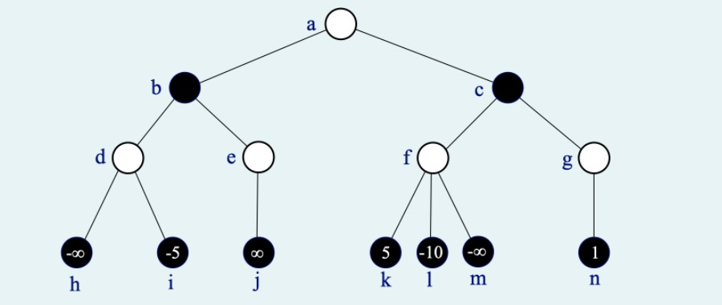

# Cvičení 1 - 9. 1. 2023

## úloha 1

Na vstupu je posloupnost n celých čísel. Určete celé číslo, které má ze všech celých čísel, které se ve vstupní posloupnosti nevyskytují, nejmenší absolutní hodnotu. Pokud existují dvě taková čísla, stačí vrátit libovolné z nich (ve vašem popisu řešení ale upřesněte, zdali v takovém případě vracíte číslo záporné či kladné).

Navrhněte postup, jak správně vyřešit úlohu s co nejlepší časovou a prostorovou složitostí (měřeno nejhorším případem) vzhledem k délce vstupní posloupnosti. Maximální počet bodů bude udělen jen za řešení s časovou i prostorovou složitostí O(n).

(a) Popište algoritmus (včetně datových struktur, které případně budete používat). Programový kód není povinný, slovní vysvětlení zvoleného postupu řešení naopak povinné je. Nepoužívejte prosím žádné netriviální datové struktury (typu zásobník, fronta, halda, slovník), jejichž algoritmus sami nepopíšete a neodvodíte jeho časovou složitost.

(b) Zdůvodněte správnost algoritmu.

(c) Odvoďte časovou a prostorovou složitost (v nejhorším případě).

Příklad:

vstup: 22 8 -5 0 -2000 2 1 20 100000 7 -15 20 -1

výstup: -2

Poznámka: Úlohu lze vyřešit s časovou i prostorovou složitostí O(n). Netriviální počet bodů bude ovšem udělen i za méně efektivní řešení.

## úloha 2

Je zadán binární strom o n vrcholech, v nichž jsou uložena navzájem různá celá čísla. Navrhněte efektivní algoritmus, který pro zadané číslo x vrátí seznam čísel všech vrcholů, které leží na stejné hladině jako vrchol s číslem x. Pokud hodnota x ve stromě není, bude vrácen prázdný seznam.

Hladinu binárního stromu tvoří všechny vrcholy se stejnou vzdáleností od kořene.

(a) Svoje řešení zapište jako funkci v Pythonu, využijte definici třídy pro vrchol binárního stromu i hlavičku funkce uvedené níže a váš kód prosím opatřete komentáři,

(b) zdůvodněte správnost,

(c) odvoďte časovou složitost (v nejhorším případě).

```
class VrcholBinStromu:
    """třída pro reprezentaci vrcholu binárního stromu""" 
    def __init__(self, info = None, levy = None, pravy = None):
        self.info = info      # data
        self.levy = levy      # levé dítě 
        self.pravy = pravy    # pravé dítě
def hladina(koren : VrcholBinStromu, x : int):
    """
    koren : kořen zadaného binárního stromu
    x     : zadané ohodnocení hledaného vrcholu
    vrátí : seznam čísel vrcholů na hladině obsahující x
    """
```

## úloha 3

Uvažte následující problém.

Vstup: Setříděné pole a délky n , hodnoty x,y takové, že x≤y
Výstup: (libovolný) index i takový, že x ≤ a[i] ≤ y
False pokud žádný takový neexistuje

Dokažte nebo vyvraťte následující tvrzení, svoji odpověď zdůvodněte:

Časová složitost řešení výše uvedeného problému porovnávacím algoritmem je Θ(log n).

Porovnávací algoritmus přistupuje k prvkům zadaným na vstupu prostřednictvím operace porovnání dvou prvků
p < q , p > q , p ≤ q , p ≥ q , p = q ,
hodnoty prvků jinak nevyužívá.

(b) (5 bodů) Jsou zadány dva aritmetické výrazy v různých notacích:

(b1) 1 2 - 3 + 4 5 - / 6 7 - *
(b2) - 1 - * - 2 + * 3 4 5 6 7

Ke každému z výrazů:

určete, o jakou notaci se jedná (infix, prefix, postfix),

sestrojte příslušný strom aritmetického výrazu

a vypište hodnoty (operátory i operandy) v něm uložené v pořadí, v němž budou navštíveny při průchodu stromem do šířky (děti každého vrcholu navštěvujeme v pořadí levé, pravé).

Ve vaší odpovědi stačí vypsat hodnoty v požadovaném pořadí, nemusíte uvádět strom ani zdůvodnění.

# Cvičení 2  - 24. 1. 2022

## úloha 1

Na vstupu je posloupnost n celých čísel. Zjistěte, zdali existuje dvojice celých čísel a ≤ b taková, že jak a-1 tak b+1 v posloupnosti leží, zatímco žádné z čísel v (uzavřeném) intervalu ‹a,b› nikoliv. Pokud taková "souvislá mezera" v posloupnosti existuje, vraťte dvojici a,b takovou, že a i b jsou minimální hodnoty, splňující uvedenou podmínku. Pokud neexistuje, vraťte hodnotu None.

Navrhněte postup, jak správně vyřešit úlohu s co nejlepší časovou a prostorovou složitostí vzhledem k délce vstupní posloupnosti.

(a) Popište algoritmus: programový kód v Pythonu je vítán, ale není povinný, slovní vysvětlení zvoleného postupu řešení naopak povinné je. Nepoužívejte žádné netriviální datové struktury (typu zásobník, fronta, halda, slovník), jejichž algoritmus sami nepopíšete a neodvodíte jeho časovou složitost.

(b) Zdůvodněte správnost algoritmu.

(c) Odvoďte časovou a prostorovou složitost (v nejhorším případě).

Příklad:

vstup: 22 8 5 2000 6 5 20 100000 7 15 20 6

výstup: 9 14

## úloha 2

Na vstupu je zadán binární vyhledávací strom (BVS), v jehož vrcholech jsou uložena celá čísla a dvě celá čísla d ≤ h.
Navrhněte efektivní algoritmus, který ze zadaného BVS odstraní všechny vrcholy s hodnotami < d nebo > h a vrátí odkaz na kořen výsledného BVS.
Na výstupu tedy bude BVS, v němž jsou uloženy právě ty hodnoty ze vstupního BVS, které leží v uzavřeném intervalu ‹d,h›.

Poznámka: Ani BVS na vstupu, ani BVS na výstupu nemusí být nutně vyvážený.

(a) Svoje řešení zapište jako funkci v Pythonu, využijte definici třídy pro vrchol binárního stromu uvedenou níže a váš kód opatřete komentáři,

(b) zdůvodněte správnost,

(c) odvoďte časovou složitost.
```
class VrcholBinStromu:
    """třída pro reprezentaci vrcholu binárního stromu""" 
    def __init__(self, info = None, levy = None, pravy = None):
        self.info = info # data
        self.levy = levy # levé dítě 
        self.pravy = pravy # pravé dítě 
def zuzeniBVS(koren: VrcholBinStromu, d: int, h: int) -> VrcholBinStromu:
    """
    koren : kořen zadaného binárního vyhledávacího stromu
    vrátí : kořen zúženého binárního vyhledávacího stromu
    """
```

## úloha 3

(a) (5 bodů) Dokažte nebo vyvraťte každé z následujících tvrzení:

pro libovolné tři funkce f, g, h: N → R+ platí

jestliže f = O( g ) a g = O( h ) , potom f · g = O( h )

pro libovolné tři funkce f, g, h: N → R+ platí

jestliže f = O( g ) a g = O( h ) , potom f · g = O( h^2 )

pro libovolné tři funkce f, g, h: N → R+ platí

jestliže f = O( g ) a g = O( h ) , potom f · g = O( h^3 )

Svoji odpověď zdůvodněte, tj. tvrzení dokažte (pokud platí) či sestrojte protipříklad (pokud neplatí). Nestačí jen napsat, že je to triviální či že to bylo na přednášce / cvičeních apod.

(b) (5 bodů) Budeme pracovat s minimalistickou binární haldou (v kořeni je minimum). Potřebujeme implementovat operaci zrušení zadaného prvku z haldy:

vstupem algoritmu bude halda a odkaz na jeden její vrchol x, jehož hodnotu chceme zrušit
výstupem bude patřičně změněná halda.

V následujícím popisu si haldu představujeme v podobě binárního stromu. Požadovaný algoritmus jsme implementovali takto:

Odebereme z haldy její poslední vrchol, tzn. vrchol ležící v poslední vrstvě haldy co nejvíce vpravo.
Hodnotou tohoto odebraného vrcholu nahradíme hodnotu ve vrcholu x.

Dále postupujeme stejně, jako při standardní operaci odebrání minima z haldy:
novou hodnotu vrcholu x porovnáme s hodnotami v obou jeho dětech v případě potřeby vyměníme s menším z obou dětí
a obdobným způsobem postupujeme dále haldou směrem dolů, dokud je zapotřebí vyměňovat hodnoty.

Rozhodněte, zda je popsaná implementace požadovaného algoritmu korektní. Svoje tvrzení zdůvodněte.

# Cvičení 3 - 17. 1. 2022

## úloha 1

Na vstupu je dána posloupnost kladných celých čísel, Čísla se mohou v posloupnosti libovolně opakovat. Navrhněte efektivní algoritmus, který v posloupnosti určí délku maximálního souvislého úseku, který se v posloupnosti nachází alespoň dvakrát. Oba výskyty úseku se mohou (ale nemusí) částečně překrývat.
Navrhněte postup, jak správně vyřešit úlohu s co nejlepší časovou složitostí vzhledem k délce posloupnosti n. Plný počet bodů bude udělen jen za řešení v čase O(n2) a pracovní paměti O(1) (tj. můžeme předpokládat, že vstup je uložen v datové struktuře typu pole, z níž můžeme - i opakovaně - číst, další datové struktury by ovšem měly zabírat pouze paměť konstantní velikosti).

(a) Popište algoritmus (včetně datových struktur, které případně budete používat). Programový kód není povinný, slovní vysvětlení zvoleného postupu řešení naopak povinné je. Budete-li používat nějakou pomocnou datovou strukturu, nezapomeňte popsat složitost operací nad ní prováděných.
(b) Zdůvodněte správnost algoritmu.
(c) Odvoďte asymptotickou časovou a prostorovou složitost (v nejhorším případě).

Příklad:
vstup: 5 3 1 4 1 5 9 3 1 4 1 5 9 3 1 9
výstup: 8

Poznámka: Úlohu lze vyřešit v lineárním čase, příslušný algoritmus ovšem nespadá do učiva 1. ročníku.

## úloha 2

Je zadán binární strom o n vrcholech, v nichž jsou uložena celá čísla.

Navrhněte efektivní algoritmus, který ve stromu najde podstrom s minimálním součtem hodnot všech svých listů. Funkce vrátí jako svůj výsledek hodnotu nalezeného minimálního součtu.

Poznámka: Povšimněte si, že čísla uložená ve vrcholech stromu mohou být i záporná, a podstrom může být tvořen i jediným vrcholem (tj. listem zkoumaného stromu).

(a) Svoje řešení zapište jako funkci v Pythonu, využijte definici třídy pro vrchol binárního stromu uvedenou níže a váš kód prosím opatřete komentáři,
(b) zdůvodněte správnost,
(c) odvoďte časovou a prostorovou složitost (do prostorové složitosti počítejte jen paměť, do níž se zapisuje). Pracuje vaše řešení v asymptoticky optimálním čase a prostoru?

```
class VrcholBinStromu:
    """třída pro reprezentaci vrcholu binárního stromu""" 
    def __init__(self, info = None, levy = None, pravy = None):
        self.info = info      # data
        self.levy = levy      # levé dítě 
        self.pravy = pravy    # pravé dítě
def minListy(koren : VrcholBinStromu) -> int :
    """
    koren : kořen zadaného binárního stromu
    vrátí : minimální součet hodnot listů podstromu
    """
```

## úloha 3

Dokažte nebo vyvraťte každé z následujících tvrzení:

(a1) pro libovolné tři funkce f, g, h: N → R+ platí

jestliže f = O( h ) a g = O( h ) , potom f . g = O( h2 )

(a2) pro libovolné tři funkce f, g, h: N → R+ platí

jestliže f . g = O( h2 ) , potom f = O( h ) a g = O( h )

Svoji odpověď zdůvodněte, tj. tvrzení dokažte (pokud platí) či sestrojte protipříklad (pokud neplatí). Nestačí jen napsat, že je to triviální či že to bylo na přednášce / cvičeních apod.

(b) Složitost problému vyhledání zadaného prvku v setříděném poli délky n porovnávacím algoritmem je Θ(log n).

Porovnávací algoritmus přistupuje k prvkům zadaným na vstupu prostřednictvím operace porovnání dvou prvků
x < y , x > y , x ≤ y , x ≥ y , x = y ,
hodnoty prvků jinak nevyužívá.

# Cvičení 4 - 31. 1. 2022

## úloha 1

(10 bodů) Na vstupu je dána posloupnost nul a jedniček. Navrhněte efektivní algoritmus, který v posloupnosti najde souvislý úsek, který obsahuje více jedniček než nul a rozdíl počtu jedniček a počtu nul je v něm maximální. Výsledkem algoritmu bude údaj, o kolik je v nalezeném úseku více jedniček než nul.

Navrhněte postup, jak správně vyřešit úlohu s co nejlepší časovou složitostí vzhledem k délce posloupnosti n. Budete-li používat nějakou pomocnou datovou strukturu, nezapomeňte popsat složitost operací nad ní prováděných.

(a) Popište algoritmus (včetně datových struktur, které případně budete používat). Programový kód není povinný, slovní vysvětlení zvoleného postupu řešení naopak povinné je.

(b) Zdůvodněte správnost algoritmu.

(c) Odvoďte asymptotickou časovou a prostorovou složitost (v nejhorším případě).

Příklad:

vstup: 1 1 0 1 0 0 1 1 0 1 0 1 1 0 0 1 0 0 0

výstup: 3

## úloha 2

Je zadán binární strom, v jehož vrcholech jsou uložena celá čísla. Pojmem k-tá hladina stromu označíme množinu všech vrcholů ve vzdálenosti k od kořene. Kořen samotný leží v hladině 0. Navrhněte efektivní algoritmus, který vrátí číslo hladiny, která má maximální součet ohodnocení svých vrcholů.

(a) Svoje řešení zapište jako funkci v Pythonu, využijte definici třídy pro vrchol binárního stromu uvedenou níže a váš kód opatřete komentáři,

(b) zdůvodněte správnost,

(c) odvoďte časovou složitost.
```
class VrcholBinStromu:
"""třída pro reprezentaci vrcholu binárního stromu"""
def __init__(self, info = None, levy = None, pravy = None)
self.info = info # data
self.levy = levy # levé dítě
self.pravy = pravy # pravé dítě
def maxHladina(koren: VrcholBinStromu) -> int:
"""
koren : kořen zadaného binárního stromu
vrátí : číslo hladiny s maximálním součtem ohodnocení vrcholů
"""
```

## úloha 3

Odpovězte na otázky.

(a) (5 bodů). Vstup: Minimalistická (v kořenu je minimum) binární halda uložená v poli, index jejího prvku p, nová hodnota h.

Výstup: Halda, v níž má prvek p novou hodnotu h.

Rozhodněte, zda platí:

Složitost operace změny hodnoty zadaného prvku v binární haldě o n prvcích je O(log n).

Svoji odpověď zdůvodněte, tj. tvrzení dokažte nebo vyvraťte. Nestačí jen napsat, že je to triviální či že to bylo na přednášce / cvičeních apod.

(b) (5 bodů) Jsou zadány dva aritmetické výrazy, první v prefixové, druhý v postfixové notaci:

(b1) - - 1 * * - 2 * 3 4 + 5 6 7 - 8 9

(b2) 1 2 3 4 5 * 6 + * - 7 * 8 - 9 - -

Ke každému z výrazů sestrojte příslušný strom aritmetického výrazu a poté vypište všechny hodnoty (čísla i znaménka) uložené v jeho vrcholech v pořadí, v němž budou navštíveny při průchodu stromem do šířky (děti každého vrcholu navštěvujeme v pořadí levé dítě, pravé dítě). Ve vaší odpovědi stačí vypsat hodnoty v požadovaném pořadí, nemusíte uvádět strom ani zdůvodnění.

# Cvičení 4 - vzorová zkouška

## úloha 1

Navrhněte efektivní algoritmus, který v zadané posloupnosti celých čísel najde maximální hodnotu, která se neopakuje, a na výstupu vrátí tuto hodnotu i její pozici v posloupnosti (pokud existuje, jinak vrátí výsledek None).

(a) Popište algoritmus (včetně datových struktur, které případně budete používat). Programový kód v Pythonu není povinný, slovní vysvětlení zvoleného postupu řešení naopak povinné je.

(b) Zdůvodněte správnost algoritmu.

(c) Odvoďte asymptotickou časovou a prostorovou složitost (v nejhorším případě).

Příklad: 

vstup: 2 2 6 1 1 7 9 2 5 7 9 

výstup: 6 2 (pozice v posloupnosti číslujeme od 0) 

## úloha 2

Je zadán binární strom, v jehož vrcholech jsou uložena přirozená čísla. Navrhněte efektivní algoritmus, který vypíše čísla uložená ve všech listech stromu, ležících na poslední hladině (tj. listech v maximální vzdálenosti od kořene).

(a) Svoje řešení zapište jako funkci v Pythonu, využijte definici třídy pro vrchol binárního stromu níže,

(b) zdůvodněte správnost,

(c) odvoďte časovou složitost.

```
class VrcholBinStromu:
    """třída pro reprezentaci vrcholu binárního stromu""" 
    def __init__(self, x = None, levy = None, pravy = None)
        self.info = x # data 
        self.levy = levy # levé dítě 
        self.pravy = pravy # pravé dítě
```

## úloha 3

(a) Dokažte nebo vyvraťte. Pro každou dvojici funkcí f,g: N→R+ platí:

Pokud f(n)=O(g(n)), pak 2^f(n)=O(2^g(n)).

(b) Dokažte nebo vyvraťte.

Zadaný prvek lze z binární haldy o n prvcích odstranit v čase O(log n).

Můžete předpokládat, že halda je uložena v poli a prvek je zadán svojí pozicí (tj. indexem) v tomto poli. 

# Cvičení 5 - 10. 1. 2022

## úloha 1

Identická s nějakou předchozí úlohou, hledání mezi jedničkami a nulami.

## úloha 2

je zadán binární strom o n vrcholech, v nichž jsou uložena navzájem různá celá čísla. Navrhněte efektivní algoritmus, který ve stromu najde cestu z vrcholu se zadanou hodnotou x do vrcholu se zadanou hodnotou y. Nalezenou cestu funkce vrátí jako seznam čísel vrcholů tvořících tuto cestu. Pokud hodnota x či y ve stromu není, funkce vrátí prázdný seznam.

(a) Svoje řešení zapište jako funkci v Pythonu, využijte definici třídy pro vrchol binárního stromu uvedenou níže a váš kód opatřete komentáři,

(b) zdůvodněte správnost,

(c) odvoďte časovou složitost.

```
class VrcholBinStromu:
    """třída pro reprezentaci vrcholu binárního stromu""" 
    def __init__(self, x = None, levy = None, pravy = None)
        self.info = x # data 
        self.levy = levy # levé dítě 
        self.pravy = pravy # pravé dítě
def cesta(koren: VrcholBinStromu, x : int, y : int) -> list<int> :
    """
    koren : koren zadaného binárního stormu
    x,y   : hodnoty koncovych vrcholu hledane cesty
    vrati : seznam cisel vrcholu na ceste z x do y
    """
```

## úloha 3

Odpovězte na otázky, své odpovědi vždy zdůvodněte.

(a) Dokažte nebo vyvraťe každé z následujících tvrzení:

(a1) pro libovolné tři funkce f,g,h: N -> R+ platí:
jestliže f = O(h) a g = Omega(h), potom f = O(g)

(a2) pro libovolné tři funkce f,g,h: N -> R+ platí:
jestliže f = O(h) a g = Omega(h), potom f + g = Omega(h)

(a3) pro libovolné tři funkce f,g,h: N -> R+ platí:
jestliže f = O(h) a g = Omega(h), potom f * g = Omega(h)

Svoji odpověď zdůvodněte, tj. tvrzení dokažte (pokud platí) či sestrojte protipříklad (pokud neplatí).

(b) Strom hry dvou hráčů byl vygenerován do hloubky 3, všechny vrcholy v této hloubce byly ohodnoceny statickou ohodnocovací funkcí a hodnoty zbývajících vrcholů byly spočítány minimaxovým algoritmem. V bílých vrcholech je na tahu hráč maximum, v černých minimum. Výpočet bychom rádi zrychlili metodou alfa-beta prořezávání.



(b1) Jaká bude minimaxová hodnota kořenu stormu?

(b2) V jakém pořadí j+e třeba procházet strom, abychom se alfa-beta prořezáváním vyhnuli vyhodnocení co nejvíce vrcholů? Pro popis pořadí můžete využít označení vrcholů (a, b, c, ... ). Kolik vrcholů v takovém případě nemusíme navštívit?

(b3) Existuje nějaký průchod stromem, kdy alfa-beta prořezáváním nic neušetříme (tj. pro určení minimaxové hodnotykořene musíme navštívit a ohhodnotit všech 14 vrcholů)? Pokud ano, popište ho, pokud ne, vysvětelte proč.

# Cvičení 6 - 15. 2. 2021

## úloha 1

Na vstupu je dána posloupnost celých čísel, čísla se mohou v posloupnosti libovolně opakovat. Navrhněte efektivní algoritmus, který určí druhou nejmenší hodnotu a počet jejích výskytů. Pracovávaná posloupnost není uložena v poli, prvky posloupnosti se postupně načítají ze standardního vstupu. Plný počet bodů bude udělen jen za korekntí řešení s minimálními časovými i prostorovými nároky.

(a) Popište algoritmus (včetně datových struktur, které případně budete používat). Programový kód v Pythonu není povinný, slovní vysvětlení zvoleného postupu řešení naopak povinné je.

(b) Zdůvodněte správnost algoritmu.

(c) Odvoďte časovou a prostorovou složitost (v nejhorším příadě). Je vaše řešení asymptoticky optimální?

Příklad:

Vstup: 8 4 6 5 6 1 4 4 1 7

Výstup: 4 3

Poznámka:

Pozor na to, že pokud si vstup načtete do pomocné datové struktury (typu pole), prostorová složitost se zvýší na Omega(n).

## úloha 2

Je zadán binární strom. Navrhněte efektivní algoritmus, který zjistí průměrnou výšku stromu, definovoanou jako součet délek všech cest z kořene do listu / počet listů.

(a) Svoje řešení zapište jako funkci v Pythonu (která obdrží kořen binárního stormu a vrátí jeho průměrnou výšku), přitom využije definici třídy pro vrchol binárního stromu níže a kód opatřen komentáři,

(b) zdůvodněte správnost.

(c) pdvpďte časovou a prostorovou složitost.

```
class VrcholBinStromu:
    """třída pro reprezentaci vrcholu binárního stromu""" 
    def __init__(self, x = None, levy = None, pravy = None)
        self.info = x # data 
        self.levy = levy # levé dítě 
        self.pravy = pravy # pravé dítě
```

Příklad:


Výstup: 3.2 ( = (3 + 3 + 2 + 4 + 4)/5 )

## úloha 3

Dokažte nebo vyvraťe:

(a) Pro libovolné dvě funkce f, g: N -> R+ platí:
f = O(g) právě tehdy, když g = Omega(f)

(b) Je možné určit vzdálenost zadaných dvou vrcholů v grafu pomocí algoritmu procházení grafu do hloubky? Je to vhodná metoda pro řešeí tohoto problému? Své odopvědi zdůvodněte.

(c) K zadanému aritmetickému výrazu v postfixové notaci:

1 2 - 3 - 4 5 + * 6 7 - /

- sestrojte odpovídající strom aritmetického výrazu
- na kořen thoto stromu aplikujte operaci LL-rotace (?)
- výsledný strom opět reprezentuje aritmetický výraz
- výsledný výraz zapište v prefixové a infixové notaci
